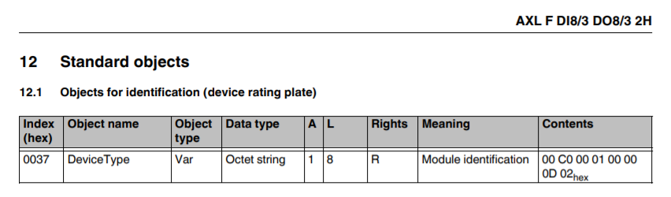
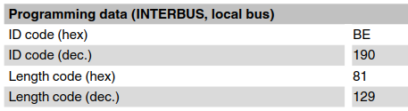

# PLCnext Technology - Bus Conductor

[](https://github.com/PLCnext/BusConductor/issues?q=is%3Aopen+is%3Aissue+label%3Afeature-request+sort%3Areactions-%2B1-desc)
[](https://github.com/PLCnext/BusConductor/issues?utf8=✓&q=is%3Aissue+is%3Aopen+label%3Abug)
[](LICENSE)
[](https://www.phoenixcontact.com/plcnext)
[](https://www.plcnext-community.net)

| Date       | Version | Authors                     |
|------------|---------|-----------------------------|
| 21.07.2021 | 1.3     | Martin Boers                |

## Description

This application can be used to configure a local PLCnext Control I/O bus, containing either Axioline or Inline I/O modules, without the need to hard-code the specific I/O configuration either directly in .tic files, or indirectly using PLCnext Engineer.

This may be useful in applications where the precise I/O configuration is not known at design-time, or must be changed dynamically at run-time. Examples include:

1. A machine builder who uses a single PLCnext Engineer project for multiple machine configurations, where the PLC program dynamically adapts itself based on the arrangement of local I/O modules detected.

1. A PLCnext Control device used as a general-purpose RTU, data logger, or multiplexer, where the I/O arrangement must be flexible.

1. A custom PLCnext Control run-time written in any language (e.g. C/C++, rust, node.js, python) which requires flexible local I/O, but which does not want to manipulate .tic files. This can be used by applications like [Sample Runtime](https://github.com/PLCnext/SampleRuntime) so that PLCnext Engineer or IoConf are no longer required for I/O configuration.

Software developers who want to build this type of functionality into their own projects are free to use this application as a reference.

Note: The terms "Inline" and "Interbus" are used interchangeably in this document, since the Inline I/O system uses the Interbus communication protocol.

## Alternatives

The C++ code in this project has been ported to IEC-61131 code by Gianluca Riboldi. That solution is described here:
https://www.plcnext-community.net/en/hn-makers-blog/473-dynamic-axiobus-configuration-totally-iec-61131.html

## Background

On a PLCnext Control device, local I/O can only be accessed via system components that are started as part of the plcnext process. The system components that handle local I/O - either Axioline or Inline - must be configured using TIC ("Technology Independent Configuration") files, which are XML files in a format defined by Phoenix Contact.

Currently the only practical method of generating a valid set of TIC files is by using either PLCnext Engineer or IoConf software, where the arrangement of local I/O modules must be configured manually. Both of these software packages generate TIC files for the specified hardware configuration. In the case of PLCnext Engineer, these TIC files are sent to the PLC with the PLCnext Engineer project.

Once on the PLC, TIC files are read during startup of the plcnext process. TIC files cannot be reloaded while the plcnext process is running.

This application demonstrates how to use a single set of TIC files to configure and re-configure the arrangement of local I/O modules that are connected to a PLC - without the need to manually create different I/O module arrangements in PLCnext Engineer.

## Building from source

The project can be built using the PLCnext CLI tool, either from the command-line or from Eclipse (with the PLCnext add-in). A suitable SDK for AXC F 1152 or AXC F 2152 is required. The SDK version should match the firmware version on the controller.

Before building, use plcncli to set the project target to match your SDK and controller version. Useful plcncli commands include:

   ```bash
   plcncli get project-sdks                        # Gets the current target(s)
   plcncli set target --remove --name axcf2152     # Removes an existing target from the project
   plcncli set target --add -n axcf2152 -v 2021.6  # Adds a new target to the project
   ```

When building from the command line, the following commands should be called in sequence from the project root directory:

   ```bash
   plcncli generate code
   plcncli generate config
   plcncli build
   plcncli deploy
   ```

## Operation

The BusConductor library contains one component, called BcComponent. One instance of this component must be created by the user. The component includes one GDS port named "BusConductor", which is a structure containing the following fields:

| Field name        | C++ Type | Direction | Description                                                         |
|-------------------|----------|-----------|---------------------------------------------------------------------|
| CONFIG_REQ        | boolean  | input     | Request to (re-)configure the local bus                              |
| CONFIG_MUST_MATCH | boolean  | input     | Local bus configuration must match the user-specified configuration |
| START_IO_REQ      | boolean  | input     | Request to start local I/O exchange                                 |
| CONFIGURED        | boolean  | output    | Local bus has been (re-)configured                                  |
| NUM_MODULES       | uint16   | output    | Total number of local I/O modules detected                          |

The two REQ commands are processed on a rising edge. They both be set in sequence, and START_IO_REQ will not be processed if CONFIGURED is not TRUE.

If CONFIG_MUST_MATCH is TRUE, then the user must place a file named `config.txt` in the PLC directory `/opt/plcnext/projects/BusConductor`. This file contains the expected local I/O module arrangement, and is checked (if necessary) during the processing of the CONFIG_REQ command. If there is any mis-match detected between the contents of this file and the actual local I/O configuration, then CONFIGURED will remain FALSE, and the bus cannot be started. In this case, check the Output.log file on the PLC for error messages.

If CONFIG_MUST_MATCH is FALSE, then no configuration checking is done, and a `config.txt` file does not need to be provided.

The CONFIGURED output variable from the BusConductor component is latched, and is only reset on a rising edge of the CONFIG_REQ input. Once running, the real-time status of the local I/O bus should be monitored using the diagnostics variables provided by the PLCnext Control device (refer to the "Local bus diagnostics" section below).

Once the local bus is running, process data can be exchanged with all local I/O modules using the GDS ports "Arp.Io.AxlC/0.DI4096" (inputs) and "Arp.Io.AxlC/0.DO4096" (outputs). Process data from each I/O module will appear in these two arrays in the same order that the modules appear on the local bus. The amount of process data for each I/O module can be obtained from the data sheet for that module.

Note that this app starts all I/O modules using the configuration that is stored in the module. Any changes to module-specific configuration (e.g. analog output channel configuration) must be done separately, using (for example) the `PDI_WRITE` function block in the PLCnext Controller library, or the Acyclic Communication RSC service.

## Quick start

This app can be built as a PLCnext Engineer Library, but can be used without PLCnext Engineer. This quick-start covers both cases. Use of this app without PLCnext Engineer requires advanced knowledge of [file-based configuration](https://www.plcnext.help/te/PLCnext_Runtime/Configuration_files.htm) and operation of PLCnext Control programs.

### Quick Start using PLCnext Engineer

- [Create a new PLCnext Engineer project](https://youtu.be/I-FeT3p6cGA).
- Keep the default local bus type (Axioline), or [switch  the local bus type to InLine](https://www.youtube.com/watch?v=5JoVf4q7Hzg&t=166s).
- Create a generic I/O configuration. In the PLCnext Engineer Components Search box, enter "AXL F physcial" (sic) for Axioline, or "IB IL 256" for Inline. Drag the generic I/O module from the Component library to the Axioline or Inline controller in the Project tree.
- Create the following user-defined data types

   For Axioline I/O:

   ```text
   TYPE
     ARR_LOCAL_IO : ARRAY [1..512] OF BYTE;
   END_TYPE
   ```

   For Inline I/O:

   ```text
   TYPE
     ARR_LOCAL_IO : ARRAY [1..256] OF BYTE;
   END_TYPE

   ```

   For both Axioline and Inline I/O:

   ```text
   TYPE
     BUS_CONDUCTOR       : STRUCT
       CONFIG_REQ        : BOOL;
       CONFIG_MUST_MATCH : BOOL;
       START_IO_REQ      : BOOL;
       CONFIGURED        : BOOL;
       NUM_MODULES       : UINT;
     END_STRUCT
   END_TYPE
   ```

- Create a local IEC program in any language. In the variable table for that program, declare the following variables:

   | Name              | Type          | Usage    |
   |-------------------|---------------|----------|
   | Field_Inputs      | ARR_LOCAL_IO  | IN Port  |
   | Field_Outputs     | ARR_LOCAL_IO  | OUT Port |
   | BusConfig_Inputs  | BUS_CONDUCTOR | IN Port  |
   | BusConfig_Outputs | BUS_CONDUCTOR | OUT Port |

- In a Code sheet for the local IEC program, add the following logic:

   ```text
   BusConfig_Outputs.CONFIGURED := BusConfig_Inputs.CONFIGURED;
   BusConfig_Outputs.NUM_MODULES := BusConfig_Inputs.NUM_MODULES;
   ```

   (This is a work-around for a current limitation on Component Ports in PLCnext Engineer)

- Create one instance of the local IEC program in a PLCnext Task.
- In the PLCnext Port List, connect the `Field_Inputs` and `Field_Outputs` to the `DO4096` and `DI4096` ports on the generic Axioline I/O module, or the `DO2048` and `DI2048` ports on the generic Inline I/O module.
- Add the BusConductor user library to the PLCnext Engineer project.
- Create one instance of the `BcProgram` program (from the BusConductor library) in a PLCnext Task.
- In the PLCnext Port List, connect the ports `BusConfig_Inputs` and `BusConfig_Outputs` to the `BusConductor` port on `BcComponent1`.
- Download the PLCnext Engineer project to the PLC and enter Debug mode.
- Set the variable `BusConfig_Outputs.CONFIG_MUST_MATCH` to FALSE.
- Set the variable `BusConfig_Outputs.CONFIG_REQ` to TRUE.
- Check that the variable `BusConfig_Inputs.CONFIGURED` goes TRUE, and `BusConfig_Inputs.NUM_MODULES` is set to the total number of I/O modules on the local bus. The local bus is now configured and ready to exchange I/O data.
- Set the variable `BusConfig_Outputs.START_IO_REQ` to TRUE.
- Check that the local bus is running, using the standard diagnostics variables (described below). The local bus is now exchanging I/O data with the `Field_Inputs` and `Field_Outputs` variables.

Process Data from each I/O module is mapped to the `Field_Inputs` and `Field_Outputs` byte arrays. Check the documentation for each I/O module to see how many bytes of process data are provided by that module.

### Quick Start without PLCnext Engineer

This example describes the use of Axioline I/O. A similar procedure is used to configure Inline I/O.

Installing this application without PLCnext Engineer requires advanced knowledge of [file-based configuration](https://github.com/PLCnext/CppExamples/blob/master/Examples/NoEngineer/README.MD) and operation of PLCnext Control programs.

Procedure:

- Clone the Github repository and build the application from source, using the instructions above.
- Using `ssh` on the host machine, log in to the PLC as admin.
- On the PLC, create a new directory for this project, e.g.

   ```text
   mkdir /opt/plcnext/projects/BusConductor
   ```

- Copy the contents of the `generic_axioline` directory from the host to the PLC directory `/opt/plcnext/projects/BusConductor`, e.g.

   ```text
   cd generic_axioline
   scp -r * admin@192.168.1.10:~/projects/BusConductor
   ```

   This directory contains the generic Axioline bus configuration, including a valid set of TIC files.
- Copy the following application files from the host machine to the correct sub-directories on the PLC:
   - `libBusConductor.so` and all the associated meta configuration files.
   - A PLM configuration file to load the BusConductor program library.
   - An ESM configuration file to create an ESM task and an instance of the BusConductor program.

   <br/>Examples of these files, including the correct directory structure, are contained in the `no_engineer` directory in this repository. The contents of this directory can be copied to the PLC directory `/opt/plcnext/projects/BusConductor`, replacing any files with the same name that were copied from the `generic_axioline` directory. e.g.

   ```text
   cd no_engineer
   scp -r * admin@192.168.1.10:~/projects/BusConductor
   ```

- On the PLC, change the 'current' symlink to point to the new project directory.

   ```text
   cd /opt/plcnext/projects
   rm current
   ln -s BusConductor current
   ```

    This tells the PLCnext Control device to use this as the default project, which will load all the configuration files from this directory.

- Restart the PLCnext runtime to create the BusConductor component.
- If using the configuration files in this example, the name of the BusConductor port in the Global Data Space will be "BcComponent1/BusConductor"

You must now send commands to the BcComponent instance from your own application via the Global Data Space. How this is done will be specific to each user application. For example, you can use a gds.config file to connect the BusConductor port to a GDS port in your own C++ project, or you can read and write GDS data by subscribing to the Data Access RSC Service in the PLC. In any case, be sure to include the following logic in your application:

   ```text
   BusConfig_Outputs.CONFIGURED = BusConfig_Inputs.CONFIGURED;
   BusConfig_Outputs.NUM_MODULES = BusConfig_Inputs.NUM_MODULES;
   ```

   (This is a work-around for a current limitiation on Component Ports in PLCnext Engineer)

Once the local bus is running, I/O data can be exchanged with a user application in a number of ways. Entries in a gds.config file can be used to connect I/O data to GDS ports in the user application, or the ANSI-C interface can be used to read and write I/O data.

An example of how to use the Data Access RSC Service (for GDS access) and the ANSI-C libraries (for I/O access) are given in the [Sample Runtime](https://github.com/PLCnext/SampleRuntime) example. This sample could be modified to use the BusConductor component to start the Axioline bus, which would eliminate the need to use PLCnext Engineer to generate a different I/O configuration for each specific arrangement of I/O modules.

## Format of user confguration file - /opt/plcnext/projects/BusConductor/config.txt

If provided, this file must contain at least one line. Each line must contain a single integer in base 10 format. There must be no blank lines.

If the format of the `config.txt` file is not correct, or if there are differences between the expected and actual local I/O configurations, then these will be reported in the `Output.log` file in the PLC directory `/opt/plcnext/logs`

The numbers in the configuration file will be interpreted as follows:

### Axioline

| Line number(s) | Meaning                              |
|----------------|--------------------------------------|
| 1              | Total number of I/O modules expected |
| 2-5            | Device Type for first I/O module     |
| 6-9            | Device Type for second I/O module    |
| 10-13          | Device Type for third I/O module     |
|  :             |              :                       |
|  :             | Device Type for last I/O module      |

Device Type is specified as a series of 8 bytes, unique for each type of local I/O module.
These 8 bytes are represented in the config.txt file as 4 x 16 bit integers (in base 10 format) as follows:

| Line number | Device Type bytes          |
|-------------|----------------------------|
| x           | MSB = byte 7, LSB = byte 6 |
| x+1         | MSB = byte 5, LSB = byte 4 |
| x+2         | MSB = byte 3, LSB = byte 2 |
| x+3         | MSB = byte 1, LSB = byte 0 |

The Device Type for each type of I/O module can be found in the data sheet for that module - search for the text "Device Type" or "DeviceType". For example, the data sheet for the Axioline module **AXL F DI8/3 DO8/3 2H** (part number 2702071) shows the device type as follows:



... so for an Axioline bus with a single I/O module of this type, the contents of the `config.txt` file will be:

   ```text
   1
   192
   1
   0
   3330
   ```

### Inline

| Line number(s) | Meaning                                     |
|----------------|---------------------------------------------|
| 1              | Total number of I/O modules expected        |
| 2              | Length code & ID code for first I/O module  |
| 3              | Length code & ID code for second I/O module |
| 4              | Length code & ID code for third I/O module  |
| :              |              :                              |
| :              | Length code & ID code for last I/O module   |

Length code & ID code is specified as a 16 bit integer in base 10 format. The most significant byte represents the Length code, and the least significant byte represents the ID code.

The Length code and ID code for each type of I/O module can be found in the data sheet for that module. For example, the data sheet for the Inline module **IB IL 24 DI8/HD-PAC** (part number 2700173) shows the Length code and ID code as follows:



... so for an Inline bus with a single I/O module of this type, the contents of the `config.txt` file will be:

   ```text
   1
   33214
   ```

... where 33214 is the decimal representation of 81BE (hex).

## Local bus diagnostics

Once the local I/O bus is running, diagnostics are available from the following standard GDS OUT port variables.

### Axioline

A description of each of the variables in the table below is given in the document "UM EN AXL F SYS DIAG", available for download from the Phoenix Contact website.

| Port Name                                | IEC Type   |
|------------------------------------------|------------|
| Arp.Io.AxlC/AXIO_DIAG_STATUS_REG_HI      | Bitstring8 |
| Arp.Io.AxlC/AXIO_DIAG_STATUS_REG_LOW     | Bitstring8 |
| Arp.Io.AxlC/AXIO_DIAG_STATUS_REG_PF      | BOOL       |
| Arp.Io.AxlC/AXIO_DIAG_STATUS_REG_BUS     | BOOL       |
| Arp.Io.AxlC/AXIO_DIAG_STATUS_REG_RUN     | BOOL       |
| Arp.Io.AxlC/AXIO_DIAG_STATUS_REG_ACT     | BOOL       |
| Arp.Io.AxlC/AXIO_DIAG_STATUS_REG_RDY     | BOOL       |
| Arp.Io.AxlC/AXIO_DIAG_STATUS_REG_SYSFAIL | BOOL       |
| Arp.Io.AxlC/AXIO_DIAG_STATUS_REG_PW      | BOOL       |
| Arp.Io.AxlC/AXIO_DIAG_PARAM_REG_HI       | Bitstring8 |
| Arp.Io.AxlC/AXIO_DIAG_PARAM_REG_LOW      | Bitstring8 |
| Arp.Io.AxlC/AXIO_DIAG_PARAM_2_REG_HI     | Bitstring8 |
| Arp.Io.AxlC/AXIO_DIAG_PARAM_2_REG_LOW    | Bitstring8 |

### Inline

A description of each of the variables in the table below is given in the document "IBS SYS DIAG DSC UM E", available for download from the Phoenix Contact website.

| Port Name                                | IEC Type   |
|------------------------------------------|------------|
| Arp.Io.IbM/IB_DIAG_STATUS_REG_HI         | Bitstring8 |
| Arp.Io.IbM/IB_DIAG_STATUS_REG_LOW        | Bitstring8 |
| Arp.Io.IbM/IB_DIAG_STATUS_REG_PF         | BOOL       |
| Arp.Io.IbM/IB_DIAG_STATUS_REG_BUS        | BOOL       |
| Arp.Io.IbM/IB_DIAG_STATUS_REG_RUN        | BOOL       |
| Arp.Io.IbM/IB_DIAG_STATUS_REG_ACT        | BOOL       |
| Arp.Io.IbM/IB_DIAG_STATUS_REG_RDY        | BOOL       |
| Arp.Io.IbM/IB_DIAG_STATUS_REG_SYSFAIL    | BOOL       |
| Arp.Io.IbM/IB_DIAG_STATUS_REG_WARN       | BOOL       |
| Arp.Io.IbM/IB_DIAG_STATUS_REG_QUAL       | BOOL       |
| Arp.Io.IbM/IB_DIAG_STATUS_REG_USER       | BOOL       |
| Arp.Io.IbM/IB_DIAG_STATUS_REG_CTRL       | BOOL       |
| Arp.Io.IbM/IB_DIAG_STATUS_REG_DTC        | BOOL       |
| Arp.Io.IbM/IB_DIAG_PARAM_REG_HI          | Bitstring8 |
| Arp.Io.IbM/IB_DIAG_PARAM_REG_LOW         | Bitstring8 |
| Arp.Io.IbM/IB_DIAG_PARAM_2_REG_HI        | Bitstring8 |
| Arp.Io.IbM/IB_DIAG_PARAM_2_REG_LOW       | Bitstring8 |

## Restarting the local bus after error

### Axioline

If there is an error on the local bus (e.g. missing I/O module), then the Axioline bus will restart automatically when the originally configured I/O module arrangement is detected. This feature could be used, for example, to replace a faulty I/O module without powering down the PLC. In this case, however, the faulty I/O module will still need to be powered off if it does not support hot-swapping.

### Inline

If there is an error on the local bus (e.g. missing I/O module), then the Inline bus can be restarted by resetting the START_IO_REQ flag, and then setting it again. In the case of persistent errors, this restart procedure could be repeated periodically until the error is cleared, or until a maximum number of restart attempts are made. These types of restart procedures will be specific to each application, so it is left to the user to implement this if needed.

## Dynamically changing the local bus configuration

If the arrangement of I/O modules on the local bus is changed, the user can restart the local bus by resetting the CONFIG_REQ and START_IO_REQ flags, and then setting them again in sequence.

## Changing the local I/O update rate

By default, I/O data is exchanged with local I/O modules every 500 µs. This can be changed, if required, using either PLCnext Engineer or (for applications that do not use PLCnext Engineer) by editing configuration files directly on the PLC:

### Using PLCnext Engineer

- In PLCnext Engineer, double-click on the local I/O bus controller (e.g. "Axioline F") in the Project pane, click on the Settings tab, and select the "Trigger task" menu item.
- Select a cyclic task from the drop-down list. Data will be exchanged with local I/O modules every time this task is executed.
- If no cyclic task is selected, the I/O update rate is calculated by the PLCnext Runtime.
- If no cyclic tasks are defined on any ESM, I/O data is exchanged with local I/O modules every 500 µs.

### Without PLCnext Engineer

- In the esm.config file for your project, define a cyclic task that will be used to trigger local I/O updates.
- Associate this task with an ESM.
- Add the following section to the .esm.config file:

   ```txt
     <TaskEvents>
       <TaskEvent name="Arp.Io.AxlC.OnExecuting" taskName="YourTask" event="Executing" />
       <TaskEvent name="Arp.Io.AxlC.OnExecuted" taskName="YourTask" event="Executed" />
     </TaskEvents>
   ```

## Troubleshooting

If the BusConductor component appears not to be working, check the contents of the file `/opt/plcnext/logs/Output.log`, and look for entries from the component `BusConductor.BcComponent`. This can be done with the following command:

```bash
cat /opt/plcnext/logs/Output.log | grep BusConductor.BcComponent
```

## How to get support

This app is supported in the forum of the [PLCnext Community](https://www.plcnext-community.net/index.php?option=com_easydiscuss&view=categories&Itemid=221&lang=en).
Please raise an issue with a detailed error description and always provide a copy of the Output.log file.

## Design notes

- This app is designed to be used in PLCnext Engineer, but also be useable by other C++ components. Note that the current version of PLCnext Engineer (2020.6) provides limited support for the "Component Ports" feature of the PLCnext Control firmware, and no support for component-only libraries. This project includes some features that work around these limitiations - for example, the only purpose of the program `BcProgram` in the BusConductor library is to force PLCnext Engineer to instantiate `BcComponent`, which would otherwise not be instantiated by PLCnext Engineer.

-----------

Copyright © 2019-2020 Phoenix Contact Electronics GmbH

All rights reserved. This program and the accompanying materials are made available under the terms of the [MIT License](http://opensource.org/licenses/MIT) which accompanies this distribution.
